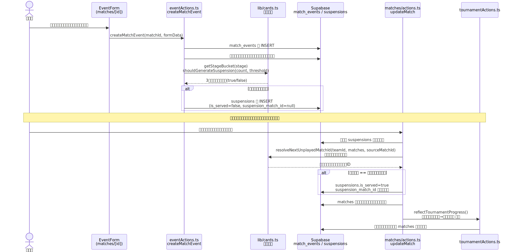

# ARCHITECTURE — fifa-dynamics-league

<!-- 勉強用の技術まとめ。「何を使っているか(事実)」と「なぜ選んだか(判断)」を分けて書く -->
<!-- 根拠がコード・STATUS.md・git log から確認できない推測には「(推測)」を付ける -->

- 一言でいうと: 身内 FIFA 大会の日程・結果・順位表・個人成績・カード/出場停止を管理する、共通パスワード制の Web アプリ
- 種別: Web アプリ（Next.js App Router、フルスタック）
- 更新日: 2026-07-16

## 技術スタック

| レイヤ | 技術 | 選定理由(なぜこれか) | 代替案と見送り理由 |
| --- | --- | --- | --- |
| 言語 | TypeScript | Next.js の標準構成。DB スキーマ由来の型（`src/lib/types.ts`）を集計関数・UI まで一貫して通せる | (推測) JavaScript のみだと集計ロジック（順位・カード判定）のような分岐が多いコードで型の恩恵が大きく外す理由がない |
| フレームワーク / 主要ライブラリ | Next.js（App Router）+ React 19 + Tailwind CSS 4 | Server Components/Server Actions で「クライアントに Supabase キーを出さない」構成を素直に組める。要件定義書 §7.1 で最初から指定。個人開発・無料枠運用と相性が良い Vercel との親和性 | (推測) SPA（Vite+React）+ 別バックエンドは、無料枠でサーバーを2つ運用する手間・CORS/認証の複雑化があり小規模用途には過剰 |
| データ保存 | Supabase PostgreSQL（無料枠） | リレーショナルな試合/選手イベント/出場停止の関連を外部キー・CHECK 制約で表現しやすい。無料 PostgreSQL as a Service として実績があり要件定義書 §7.3 で選定済み | (推測) Firebase/Firestore は NoSQL のため「直接対決」「ステージ内イエロー集計」のような多段階の関連集計がクエリ設計上やりにくく見送り。SQLite+Vercel の組み合わせは無料枠での永続化が不安定なため除外（要件定義書に記載なし・推測） |
| 外部 API / サービス | Supabase JS SDK（`@supabase/supabase-js`、サーバー専用） | `src/lib/supabase/server.ts` で `server-only` パッケージを使い service role キーの誤混入をビルド時に検出。RLS 設計を省略できる分、実装コストを下げられる（README／要件定義書 §7.1） | RLS を有効化してクライアント直接アクセスにする案は、共通パスワードのみの認可モデルとは相性が悪く（行単位の権限分離が不要な小規模用途）見送り |
| ビルド / 実行基盤 | Vercel（Hobby プラン） | Next.js との統合が最も簡単で、GitHub push → 自動デプロイまで無料。要件定義書 §7.3 で調査済み（非商用限定・関数実行10秒以内などの制限は身内大会用途では問題にならない） | (推測) 自前 VPS 運用は無料枠に収まらず、7〜十数チーム規模の身内利用に対して運用コストが見合わない |
| テスト | Vitest | 集計ロジック（`lib/`）を純粋関数として書き、DB・UI に依存せずユニットテストする方針（要件定義書 §4, §8）。Next.js/Vite エコシステムとの親和性 | (推測) Jest でも要件は満たせるが、`@vitejs/plugin-react` を使う本プロジェクトの devDependencies 構成から Vitest が自然な選択 |

## システム構成図



- **proxy.ts**（Next.js 16 の旧 middleware）: 全ページ・全 API リクエストで署名付き Cookie（`fdl_session`）を検証し、未認証なら `/login` にリダイレクト（API は 401）。共通パスワード認証をここに一本化することで Supabase 側の RLS 設計を省略している
- **Server Components / Server Actions**: 画面表示・CRUD・イベント登録はすべてサーバー側で完結し、`lib/` の純粋関数（`standings.ts` / `cards.ts` / `rankings.ts` / `fixtures.ts` / `tournament.ts`）で集計・判定する
- **Supabase PostgreSQL**: `teams` / `matches` / `match_events` / `suspensions` / `app_settings` の5テーブル。アクセスは常にサーバー側から service role キー経由（`src/lib/supabase/server.ts`）
- 環境変数（`APP_PASSWORD` / `AUTH_COOKIE_SECRET` / `SUPABASE_URL` / `SUPABASE_SERVICE_ROLE_KEY`）は Vercel の Production/Preview/Development すべてに設定済み（STATUS.md）

## データフロー



代表的なユースケースとして、本アプリの肝である「カード集計 → 出場停止の自動生成・自動消化」の流れを示す（要件定義書 §5）。

1. 選手イベント入力画面でイエローカードを登録すると、`eventActions.ts` の `createMatchEvent` が `match_events` に INSERT した後、同一選手のステージ内イエロー枚数を集計する
2. `lib/cards.ts` の純粋関数 `shouldGenerateSuspension` が「3の倍数に達したか」を判定し、条件を満たせば `suspensions` に未消化レコードを INSERT する（対象試合はこの時点では未確定）
3. 後日、対象チームの試合を「終了」に更新するタイミングで `matches/actions.ts` の `updateMatch` が、未消化の全 suspension について `resolveNextUnplayedMatchId`（＝チームの「次の未実施試合」を日時順に動的解決）を呼び、その結果が今回終了した試合と一致すれば `is_served=true` に確定する
4. **重要な設計ポイント（STATUS.md より）**: 停止発生元の試合自身は次試合解決の候補から除外する（`excludeMatchId`）。除外しないと、カード発生試合がまだ `scheduled` のうちに停止対象がその試合自身に解決されてしまう不具合があり、実装中に発見・修正・テスト済み
5. 試合更新後、`tournamentActions.ts` の `reflectTournamentProgress` が呼ばれ、グループリーグ全終了時の準決勝自動生成や、準決勝決着後の決勝/3位決定戦自動生成などトーナメント進行を反映する

## 実行環境・起動方法

- 起動方法: `npm install` → `.env.example` を `.env.local` にコピーして値を設定 → `npm run dev`（http://localhost:3000）
- 必要な環境変数・認証情報: `APP_PASSWORD`（共通パスワード）/ `AUTH_COOKIE_SECRET`（Cookie 署名鍵）/ `SUPABASE_URL` / `SUPABASE_SERVICE_ROLE_KEY`
- データの保存先: Supabase PostgreSQL（本番: 実 Supabase プロジェクト、接続・デプロイ確認済み）。本番 URL: https://fifa-dynamics-league.vercel.app

## 学びメモ

<!-- このプロジェクトで初めて触った技術、ハマりどころ、次に活かせる知見など -->

- Next.js 16 では `middleware.ts` が `proxy.ts` にリネームされている（`src/proxy.ts` のコメント参照）
- 「サーバー側からしか DB にアクセスしない」構成にすると RLS の設計自体を省略でき、小規模・単一パスワード制のアプリでは実装コストを大きく下げられる（`server-only` パッケージでクライアント混入をビルド時に検出できる点も含め）
- 出場停止の対象試合を「都度動的解決」にする設計は、日程変更に強い一方で、解決ロジックに発生元試合を含めるかどうかで不具合を作り込みやすい（STATUS.md に記録された実際のバグ事例）
- Supabase Free の「7日間無アクセスで自動ポーズ」は、大会がオフシーズンに入ると起きうる罠として要件定義の時点から明記されていた（要件定義書 §7.3, §10 未決事項）

## 図の更新方法

図のソースは `docs/architecture/*.mmd`(Mermaid)。編集したら以下で SVG を再生成する。

```bash
npx -y @mermaid-js/mermaid-cli -i docs/architecture/system.mmd -o docs/architecture/system.svg
npx -y @mermaid-js/mermaid-cli -i docs/architecture/dataflow.mmd -o docs/architecture/dataflow.svg
```
